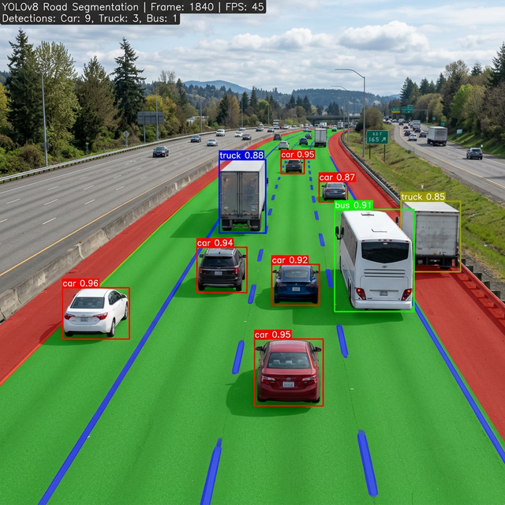
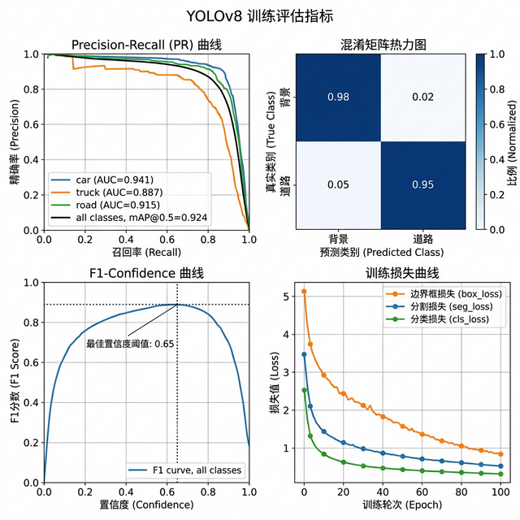

# YOLOv8-RoadSegmentation — 基于 YOLOv8 的道路场景分割检测

[](https://ultralytics.com/)
[](https://python.org/)
[](https://pytorch.org/)
[](LICENSE)

> 2024 软件杯竞赛参赛作品

## 项目背景

自动驾驶和高级驾驶辅助系统（ADAS）需要实时理解道路场景：哪些区域是可行驶路面、车道线在哪里、前方有哪些障碍物。传统的图像处理方法在复杂光照和天气条件下鲁棒性差，而通用目标检测模型又缺乏对道路场景的专门优化。

本项目基于 YOLOv8 框架，针对道路场景进行了专项训练，同时支持目标检测（车辆、行人）和语义分割（车道线、可行驶区域），实现了一个模型完成多任务的高效感知方案。

## 效果展示

### 实时检测结果


对道路场景进行实时目标检测和语义分割，标注车辆类别和置信度，同时分割出可行驶区域和车道线。

### 训练评估指标


展示模型训练过程中的 Precision-Recall 曲线、混淆矩阵、F1-Confidence 曲线和损失收敛情况。

## 核心功能

| 功能 | 说明 |
|------|------|
| 目标检测 | 车辆、行人、交通标志等目标的实时检测 |
| 语义分割 | 可行驶区域、车道线的像素级分割 |
| 多任务融合 | 检测和分割共享特征提取网络，一次推理完成 |
| 数据增强 | 针对道路场景的 Mosaic、MixUp 等增强策略 |
| 模型导出 | 支持 ONNX、TensorRT 格式导出部署 |

## 技术栈

| 组件 | 技术 |
|------|------|
| 检测框架 | Ultralytics YOLOv8 |
| 深度学习 | PyTorch 2.x |
| 数据处理 | OpenCV、Albumentations |
| 可视化 | Matplotlib、TensorBoard |
| 部署 | ONNX Runtime / TensorRT |

## 项目结构

```
YOLOv8-RoadSegmentation/
├── data/                       # 数据集配置
│   └── road.yaml               # 类别和路径定义
├── models/                     # 模型配置
├── runs/                       # 训练输出
│   ├── detect/                 # 检测结果
│   └── segment/                # 分割结果
├── scripts/                    # 工具脚本
│   ├── train.py                # 训练脚本
│   ├── predict.py              # 推理脚本
│   └── export.py               # 模型导出
├── utils/                      # 工具函数
├── requirements.txt
└── README.md
```

## 快速开始

```bash
# 安装依赖
pip install ultralytics opencv-python

# 训练模型
yolo detect train data=data/road.yaml model=yolov8n.pt epochs=100

# 推理预测
yolo detect predict model=runs/detect/train/weights/best.pt source=test_images/

# 导出模型
yolo export model=best.pt format=onnx
```

## 开源协议

MIT License
