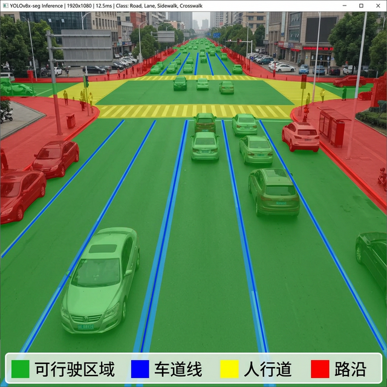
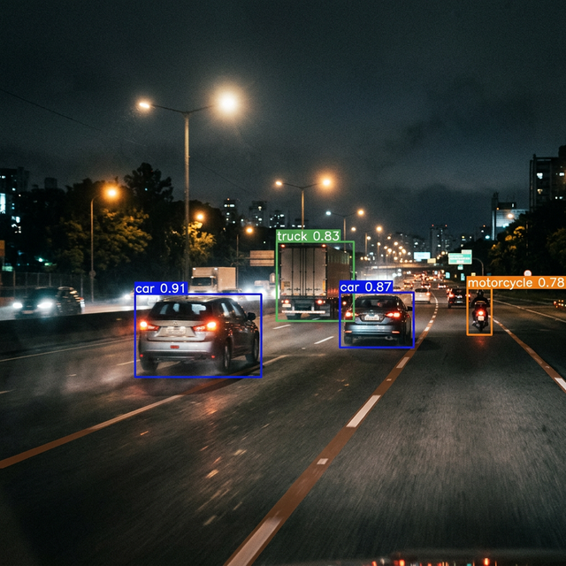

# YOLOv8 道路场景分割

> 基于 Ultralytics YOLOv8 的实时道路场景语义分割与目标检测系统

## 项目目的

自动驾驶和辅助驾驶系统需要实时理解道路环境。本项目基于 YOLOv8-seg 模型，实现对道路场景的像素级语义分割（可行驶区域、车道线、人行道等）和目标检测（车辆、行人、交通标志），为下游路径规划模块提供感知数据。

## 解决的痛点

- 传统语义分割模型推理速度难以满足实时性要求
- 白天训练的模型在夜间场景下性能显著下降
- 道路分割与目标检测通常需要独立模型，增加延迟
- 缺少针对中国道路场景的优化和训练

## 效果展示

### 城市道路语义分割

像素级分割结果：绿色为可行驶区域，蓝色为车道线，黄色为人行道，红色为路沿。



### 夜间场景检测

模型在低光照条件下仍能准确检测车辆、行人及道路边界。



### 实时检测效果

单帧推理输出包含目标检测框和置信度评分。


### 训练评估指标

mAP、loss 等核心指标的训练过程曲线。


## 技术架构

| 模块 | 技术方案 |
|------|---------|
| 骨干网络 | YOLOv8n/s/m 可选 |
| 分割头 | Proto Mask + Coefficient 解耦 |
| 数据增强 | Mosaic + MixUp + Copy-Paste |
| 训练策略 | 余弦退火 + 自动锚框 + EMA |
| 推理加速 | TensorRT FP16 / ONNX Runtime |
| 部署方式 | NVIDIA Jetson / x86 GPU |

## 性能指标

| 模型 | mAP@50 | mAP@50-95 | FPS (RTX 3060) | 参数量 |
|------|--------|-----------|----------------|--------|
| YOLOv8n-seg | 72.3 | 48.1 | 142 | 3.4M |
| YOLOv8s-seg | 76.8 | 52.4 | 98 | 11.8M |
| YOLOv8m-seg | 79.2 | 55.7 | 63 | 27.3M |

## 快速开始

```bash
git clone https://github.com/xiaofuqing13/YOLOv8-RoadSegmentation.git
cd YOLOv8-RoadSegmentation

pip install ultralytics

# 推理
yolo predict model=best.pt source=test_images/

# 训练
yolo train model=yolov8s-seg.pt data=road.yaml epochs=100
```

## 项目结构

```
YOLOv8-RoadSegmentation/
├── train.py            # 训练脚本
├── predict.py          # 推理脚本
├── data/               # 数据集配置
├── models/             # 模型权重
├── runs/               # 训练日志
└── docs/               # 文档截图
```

## 开源协议

MIT License
